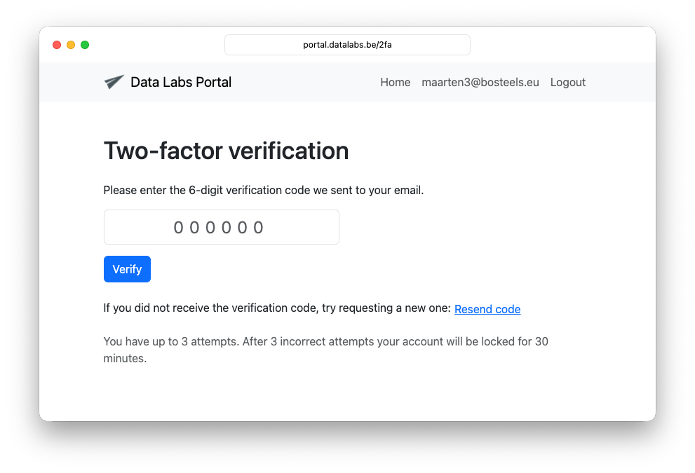
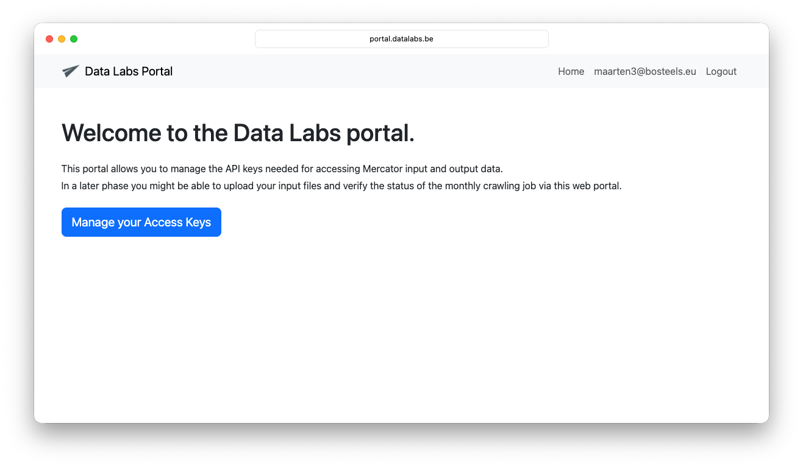
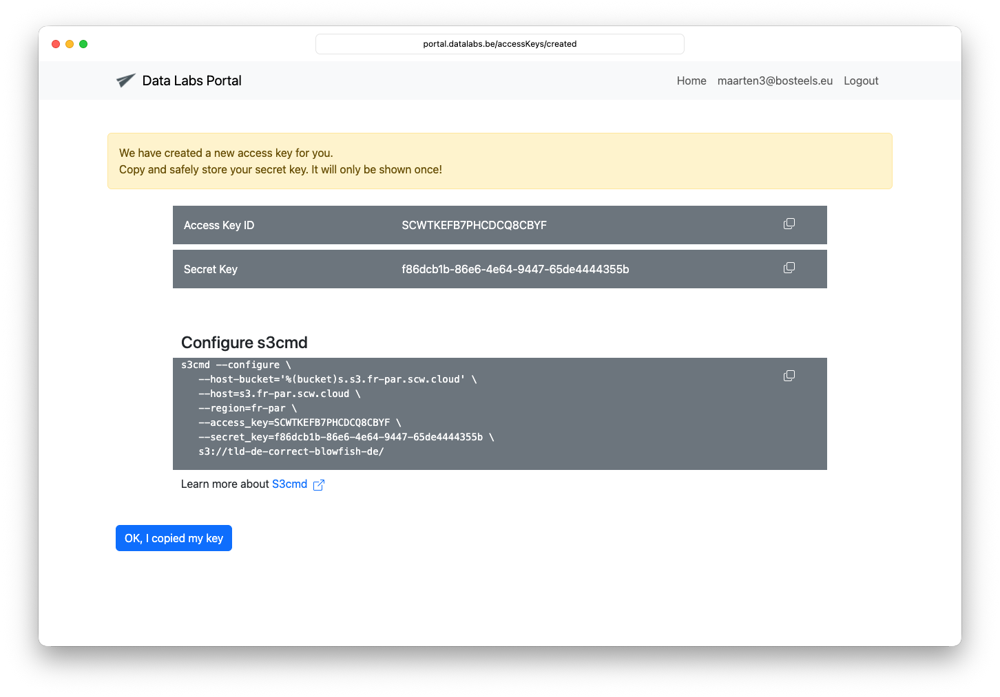

# CENTR crawler documentation
                           
This repository contains documentation for CENTR members participating in the monthly crawling of (a sample of) their zone file.

# Create an account
  
Before you can upload a sample of your zone file, you need to create a user account.

Go to https://portal.datalabs.be/register and enter your email address.
               

Make sure to use the e-mail address linked to your registry, otherwise you will see this error message:

# Click the activation link
                                      
You should now receive an e-mail with an activation link.
The mail is sent by `no-reply@datalabs.be` and should have a correct DKIM signature.

When you click the activation link, you will be asked to fill in your first and lastname and choose a password.

# You will be redirected to the login form:

                 
# Multi factor authentication

After you enter your password you will receive a one-time token via e-mail.

Copy paste the token in the form and click `Verify`.

You can now delete the e-mails with the activation link and the one-time token.

Every time you log in, you will need 
* your email address
* your password
* The one-time token you will receive via e-mail.

# Home page

Once authenticated, you will be redirected to the home page.

But you cannot yet request access keys. First, we must assign your user account to the correct TLD.
                                              
# Requesting access keys

Once you received a confirmation that your account was linked to your TLD, you can go to the home page
and request access keys.

Select the TLD and click `Request access keys`.
                                          
# Key created

Now copy and safely store your secret key. It will only be shown once!
You can create up to 3 access keys per TLD, to allow for safely rotating keys.

> [!IMPORTANT]                                          
Please note that access keys expire one year after creation.

> [IMPORTANT]                                          
Please note that access keys expire one year after creation.

> []                                          
Please note that access keys expire one year after creation.

> **Warning**
This is a warning
