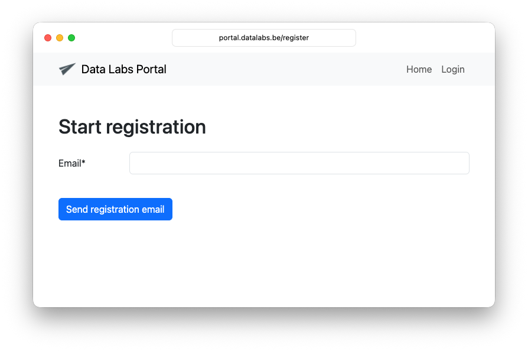
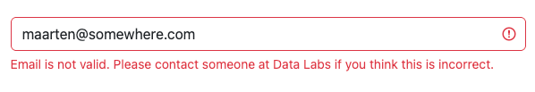
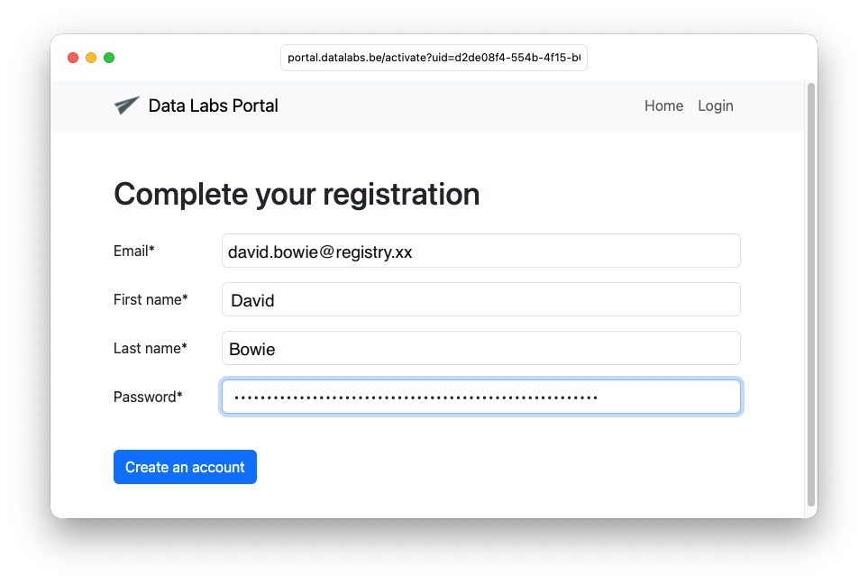
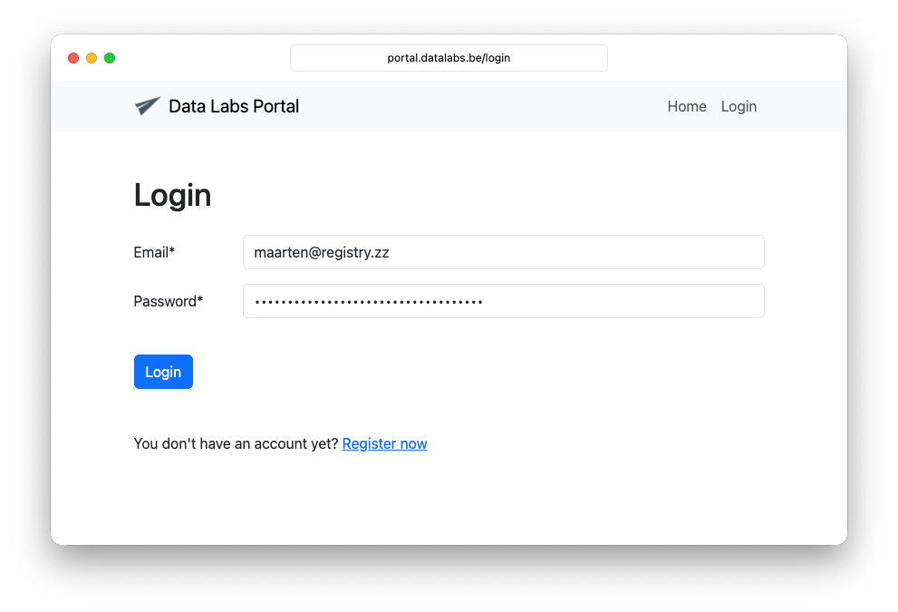

# CENTR crawler documentation
                           
This repository contains documentation for CENTR members participating in the monthly crawling of (a sample of) their zone file.

# Create an account
  
Before you can upload a sample of your zone file, you need to create a user account.

Go to https://portal.datalabs.be/register and enter your email address.
               

Make sure to use the e-mail address linked to your registry, otherwise you will see this error message:

# Click the activation link
                                      
You should now receive an e-mail with an activation link.
The mail is sent by `no-reply@datalabs.be` and should have a correct DKIM signature.

When you click the activation link, you will be asked to fill in your first and lastname and choose a password.

# You will be redirected to the login form:

                 
# Multi factor authentication

After you enter your password you will receive a one-time token via e-mail.

Copy paste the token in the form and click `Verify`.

[//]: # (![mfa]&#40;./images/mfa.png&#41;)

You can now delete the e-mails with the activation link and the one-time token.

Every time you log in, you will need 
* your email address
* your password
* The one-time token you will receive via e-mail.

# Home page

Once authenticated, you will be redirected to the home page.

[//]: # (![home-page]&#40;./images/home-page.png&#41;)

But you cannot yet request access keys. First, we must assign your user account to the correct TLD.
                                              
# Requesting access keys

Once you received a confirmation that your account was linked to your TLD, you can go to the home page
and request access keys.

[//]: # (![request-access-keys]&#40;./images/request-access-keys.png&#41;)

Select the TLD and click `Request access keys`.
                                          
# Safely store your access key

[//]: # (![key_created.png]&#40;images/key_created.png&#41;)

You will now see the newly created key.
Each access key consists of an access key ID and a secret key.
                   
> [!IMPORTANT] ⚠️                        
Safely store the access key ID and the secret key. The secret key will be shown only once!

If you failed to store the key, just delete the key and request a new one.

To allow for safely rotating keys, you can create up to three access keys per TLD.

> [!IMPORTANT]                                           
Please note that access keys automatically expire one year after creation.

